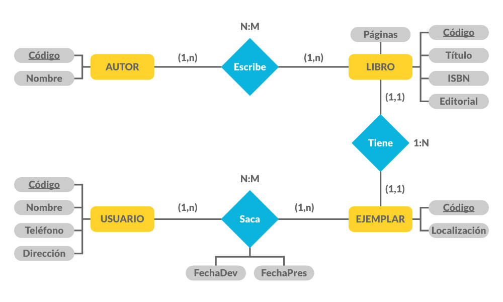

<p align="center"><a href="https://laravel.com" target="_blank"></a></p>

<p align="center">
<a href="https://travis-ci.org/laravel/framework"></a>
<a href="https://packagist.org/packages/laravel/framework"></a>
<a href="https://packagist.org/packages/laravel/framework"></a>
<a href="https://packagist.org/packages/laravel/framework"></a>
</p>


# Evidencia 2

De acuerdo con el siguiente esquema, debes generar un CRUD en Laravel para trabajar mínimo con una tabla de la base de datos.

Es importante construir las vistas necesarias para las interfaces de la aplicación, así como las rutas requeridas para su funcionamiento. Adicionalmente, debes crear los controladores que necesites. Recuerda que este desarrollo se realiza mediante Visual Studio Code o usando cualquier otro editor de código, junto con Xampp y la base de datos MySQL.

Después de analizar el caso presentado por la empresa Company ODS, realiza lo que se pide a continuación:

- Crea la clase de conexión para poder tener el software conectado a la base de datos previamente desarrollada.

- Codifica las rutas, controladores o vistas, de acuerdo con la lógica de negocio que le permita al software su funcionamiento de forma correcta.

- Recuerda crear la estructura de carpetas correctas para el proyecto.

## Instalación

Sigue estos pasos para configurar el proyecto localmente.

### 1. Requisitos Previos

- PHP instalado (verifica con `php -v`).
- Composer instalado. Puedes descargarlo desde [getcomposer.org](https://getcomposer.org/download/).

### 2. Clonar el Proyecto

```bash
git clone https://github.com/julianloaizal/biblioteca
cd tu-proyecto
```

### 3. Instalar Dependencias

```bash
composer install
```

### 4. Configurar el Archivo .env
    
```bash
    cp .env.example .env
```
Abre .env y configura la conexión a la base de datos y cualquier otra configuración necesaria. que esta en la raiz y sellama BD3.sql

### 5. Generar la Clave de Aplicación
    
```bash
    php artisan key:generate
```
### 6. Ejecutar las Migraciones y Semillas
    
```bash
    php artisan migrate --seed
```

### 7. Iniciar el Servidor

```bash
    php artisan serve
```
### 8. Acceder al Proyecto
    
```bash
    http://localhost:8000
```
